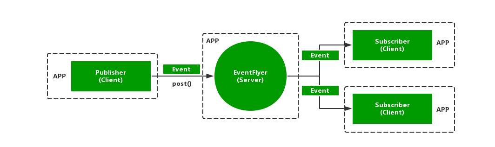

# EventFlyer
EventFlyer is a IPC library for Android, it works just as well as [EventBus](https://github.com/greenrobot/EventBus "EventBus").


## Features
- simplifies the communication between apps
- avoid life cycle issues
- support thread change

## Setup
Add the `jcenter()` repository in your root `build.gradle`.
```groovy
allprojects {
    repositories {
        jcenter()
    }
}
```

Add the dependencies in your app level `build.gradle`.
```groovy
dependencies {
    implementation 'com.yunlinos.library:eventflyer:1.0.0'
}
```

## Getting Started
1. Initialize the service responsible for forwarding messages, and the service should survive as long as possible.
```java
public class RemoteServer extends FlyerService {/* Do something */}
```

2. Define event as `eventmodel`:
```java
public class OnControlEvent {/* Do something */}
```

3. In one App, init Application:
```java
    @Override
    public void onCreate() {
        super.onCreate();
        EventFlyer.getDefault().init(new FlyerConfiguration.Builder()
                .applicationContext(this)
                .remoteServicePkgName("com.yunlinos.eventflyerserver")
                .remoteServiceClassName("com.yunlinos.eventflyerserver.RemoteServer")
                .build());
    }
```
  prepare subscribers: Declare and annotate your subscribing method:
```java
@RemoteSubscribe(threadMode = ThreadMode.MAIN)
public void onEventGet(OnControlEvent onControlEvent) {/* Do something */}
```
  Bind、unbind、register and unregister your subscriber. For example on Android, activities and fragments should usually register according to their life cycle:
```java
    @Override
    public void onCreate() {
        super.onCreate();
        EventFlyer.getDefault().bindRemoteServer();
        EventFlyer.getDefault().register(this);

    }

    @Override
    public void onDestroy() {
        super.onDestroy();
        EventFlyer.getDefault().unregister(this);
        EventFlyer.getDefault().unBindRemoteServer();
    }
```

4. In other App, init application:
```java
    @Override
    public void onCreate() {
        super.onCreate();
        EventFlyer.getDefault().init(new FlyerConfiguration.Builder()
                .applicationContext(this)
                .remoteServicePkgName("com.yunlinos.eventflyerserver")
                .remoteServiceClassName("com.yunlinos.eventflyerserver.RemoteServer")
                .build());
    }
```
  post events:
```java
    @Override
    protected void onResume() {
        super.onResume();
        EventFlyer.getDefault().bindRemoteServer();
        EventFlyer.getDefault().post(new OnControlEvent("RemoteEvent"));
    }

    @Override
    protected void onPause() {
        super.onPause();
        EventFlyer.getDefault().unBindRemoteServer();
    }
```

## License

    Copyright 2018 yunlinos <yunlinyeos@gmail.com>

    Licensed under the Apache License, Version 2.0 (the "License");
    you may not use this file except in compliance with the License.
    You may obtain a copy of the License at

        http://www.apache.org/licenses/LICENSE-2.0

    Unless required by applicable law or agreed to in writing, software
    distributed under the License is distributed on an "AS IS" BASIS,
    WITHOUT WARRANTIES OR CONDITIONS OF ANY KIND, either express or implied.
    See the License for the specific language governing permissions and
    limitations under the License.